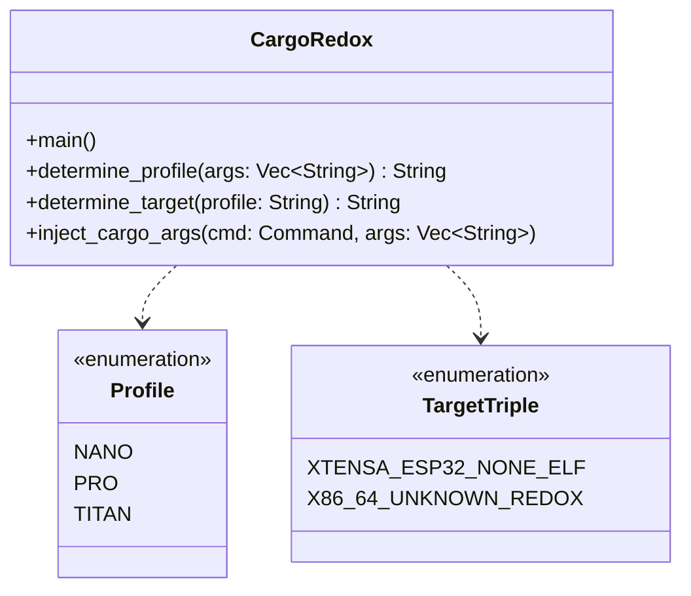

# Architecture Diagrams - cargo-redox

## High-Level Execution Flow

```mermaid
flowchart TD
    A[Invocation: cargo-redox / cargo redox] --> B[Parse Arguments & Options]
    B --> C{Profile Specified?}
    C -- CLI Flag --redox-profile --> D[Extract Profile Name]
    C -- REDOX_PROFILE Env --> D
    C -- None --> E[Default Profile: 'pro']
    D --> F[Map Profile to Target Triple]
    E --> F
    F --> G{Target == xtensa-esp32-none-elf?}
    G -- Yes --> H[Append -C link-arg=-nostartfiles to RUSTFLAGS]
    G -- No --> I[Keep standard environment]
    H --> J[Inject --target <triple> into Cargo invocation]
    I --> J
    J --> K[Spawn cargo process]
    K --> L[Forward exit code to caller]
```

## Profile Mapping Structure


