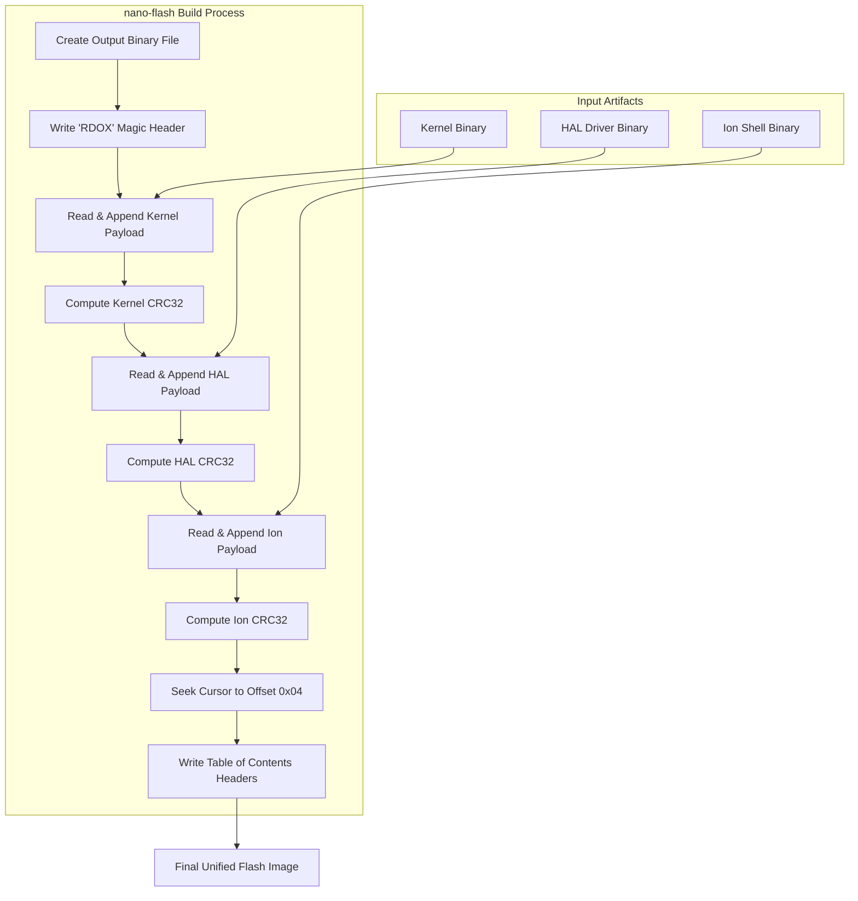
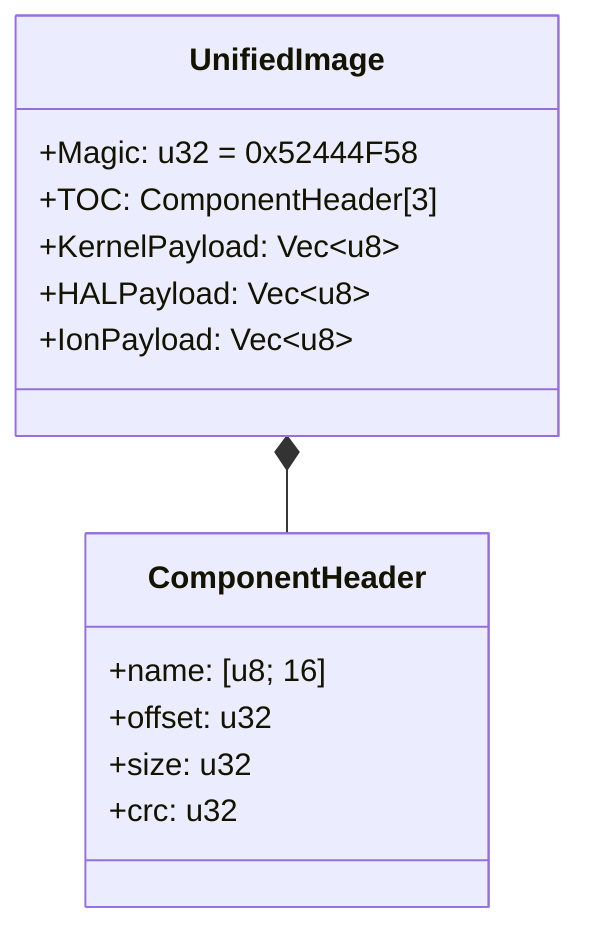

# Architecture Diagrams - nano-flash

## Image Construction Workflow

```mermaid
flowchart TD
    subgraph Input Artifacts
        K[Kernel Binary]
        H[HAL Driver Binary]
        I[Ion Shell Binary]
    end

    subgraph nano-flash Build Process
        B[Create Output Binary File] --> M[Write 'RDOX' Magic Header]
        M --> W1[Read & Append Kernel Payload]
        W1 --> C1[Compute Kernel CRC32]
        C1 --> W2[Read & Append HAL Payload]
        W2 --> C2[Compute HAL CRC32]
        C2 --> W3[Read & Append Ion Payload]
        W3 --> C3[Compute Ion CRC32]
        C3 --> Seek[Seek Cursor to Offset 0x04]
        Seek --> TOC[Write Table of Contents Headers]
    end

    K --> W1
    H --> W2
    I --> W3
    TOC --> Image[Final Unified Flash Image]
```

## Binary Layout Structure

```mermaid
classDiagram
    class UnifiedImage {
        +Magic: u32 = 0x52444F58
        +TOC: ComponentHeader[3]
        +KernelPayload: Vec~u8~
        +HALPayload: Vec~u8~
        +IonPayload: Vec~u8~
    }

    class ComponentHeader {
        +name: [u8; 16]
        +offset: u32
        +size: u32
        +crc: u32
    }

    UnifiedImage *-- ComponentHeader
```
