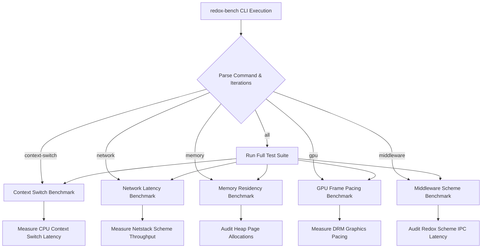
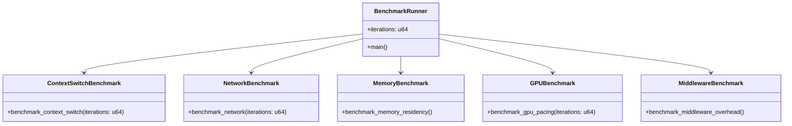

# Architecture Diagrams - redox-bench

## System Execution Flow

```mermaid
flowchart TD
    A[redox-bench CLI Execution] --> B{Parse Command & Iterations}
    B -- "all" --> C[Run Full Test Suite]
    B -- "context-switch" --> D[Context Switch Benchmark]
    B -- "network" --> E[Network Latency Benchmark]
    B -- "memory" --> F[Memory Residency Benchmark]
    B -- "gpu" --> G[GPU Frame Pacing Benchmark]
    B -- "middleware" --> H[Middleware Scheme Benchmark]

    C --> D & E & F & G & H
    
    D --> Audit1[Measure CPU Context Switch Latency]
    E --> Audit2[Measure Netstack Scheme Throughput]
    F --> Audit3[Audit Heap Page Allocations]
    G --> Audit4[Measure DRM Graphics Pacing]
    H --> Audit5[Audit Redox Scheme IPC Latency]
```

## Benchmark Component Relationships

```mermaid
classDiagram
    class BenchmarkRunner {
        +main()
        +iterations: u64
    }

    class ContextSwitchBenchmark {
        +benchmark_context_switch(iterations: u64)
    }

    class NetworkBenchmark {
        +benchmark_network(iterations: u64)
    }

    class MemoryBenchmark {
        +benchmark_memory_residency()
    }

    class GPUBenchmark {
        +benchmark_gpu_pacing(iterations: u64)
    }

    class MiddlewareBenchmark {
        +benchmark_middleware_overhead()
    }

    BenchmarkRunner --> ContextSwitchBenchmark
    BenchmarkRunner --> NetworkBenchmark
    BenchmarkRunner --> MemoryBenchmark
    BenchmarkRunner --> GPUBenchmark
    BenchmarkRunner --> MiddlewareBenchmark
```
