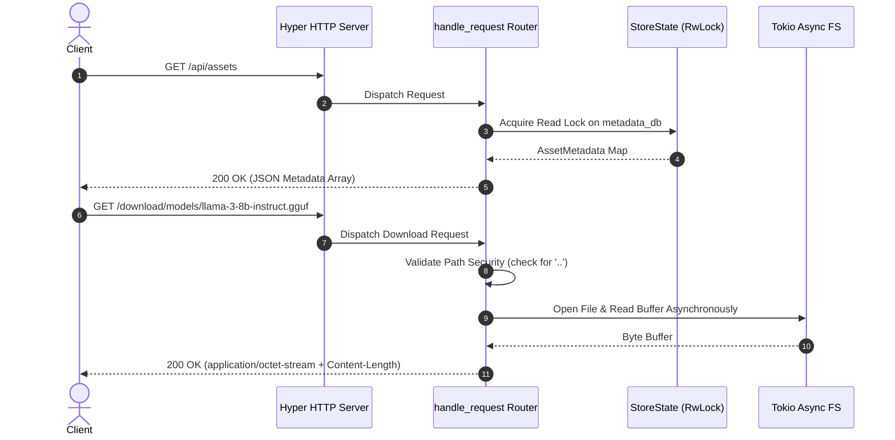
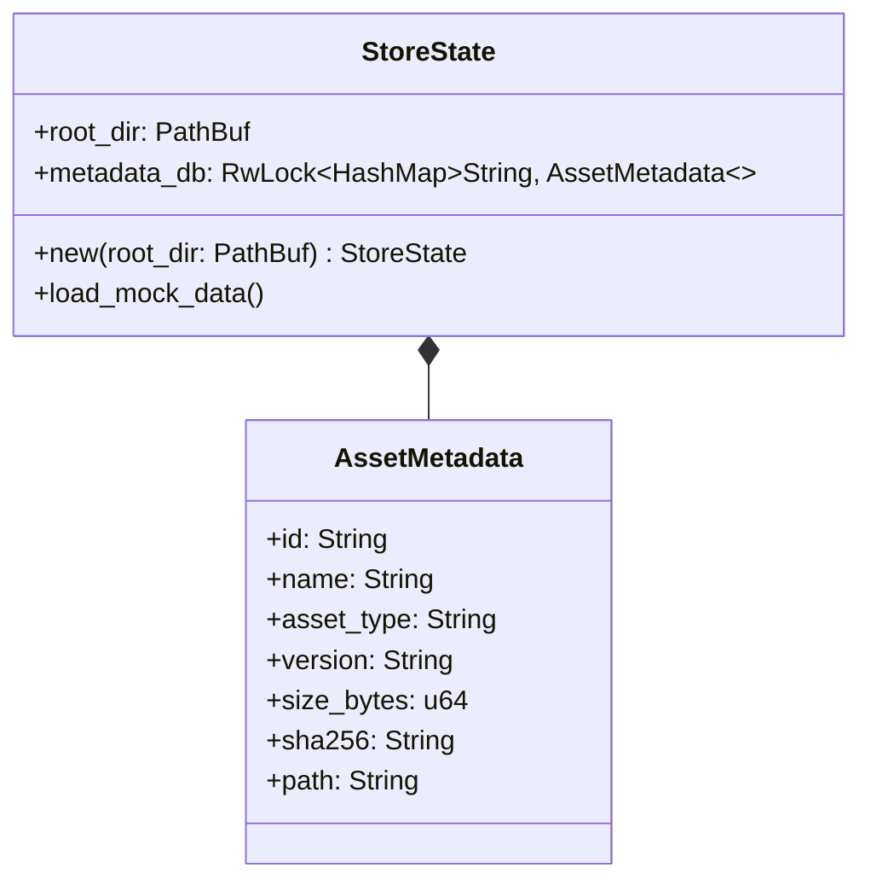

# Architecture Diagrams - redox-store

## End-to-End Request Handling Sequence

```mermaid
sequenceDiagram
    autonumber
    actor Client
    participant Server as Hyper HTTP Server
    participant Router as handle_request Router
    participant State as StoreState (RwLock)
    participant FS as Tokio Async FS

    Client->>Server: GET /api/assets
    Server->>Router: Dispatch Request
    Router->>State: Acquire Read Lock on metadata_db
    State-->>Router: AssetMetadata Map
    Router-->>Client: 200 OK (JSON Metadata Array)

    Client->>Server: GET /download/models/llama-3-8b-instruct.gguf
    Server->>Router: Dispatch Download Request
    Router->>Router: Validate Path Security (check for '..')
    Router->>FS: Open File & Read Buffer Asynchronously
    FS-->>Router: Byte Buffer
    Router-->>Client: 200 OK (application/octet-stream + Content-Length)
```

## Domain Data Model

```mermaid
classDiagram
    class StoreState {
        +root_dir: PathBuf
        +metadata_db: RwLock~HashMap~String, AssetMetadata~~
        +new(root_dir: PathBuf) StoreState
        +load_mock_data()
    }

    class AssetMetadata {
        +id: String
        +name: String
        +asset_type: String
        +version: String
        +size_bytes: u64
        +sha256: String
        +path: String
    }

    StoreState *-- AssetMetadata
```
