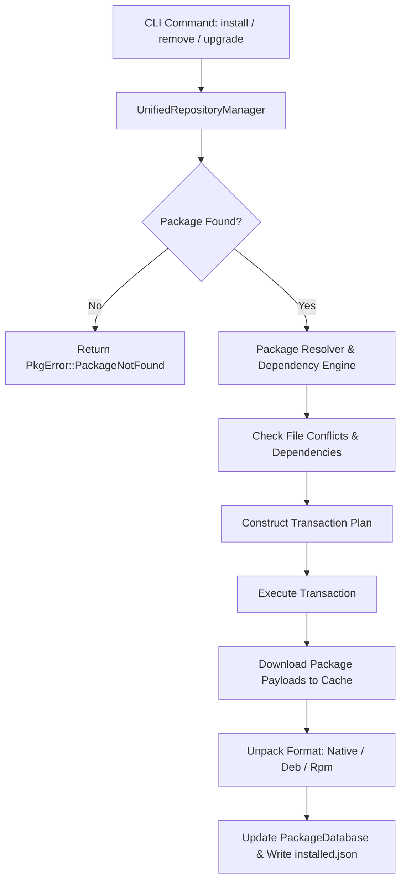
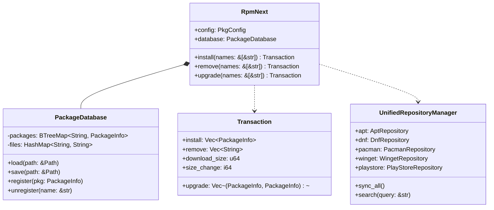

# Architecture Diagrams - rpm-next

## Package Resolution and Transaction Pipeline

```mermaid
flowchart TD
    A[CLI Command: install / remove / upgrade] --> B[UnifiedRepositoryManager]
    B --> C{Package Found?}
    C -- No --> D[Return PkgError::PackageNotFound]
    C -- Yes --> E[Package Resolver & Dependency Engine]
    E --> F[Check File Conflicts & Dependencies]
    F --> G[Construct Transaction Plan]
    G --> H[Execute Transaction]
    H --> I[Download Package Payloads to Cache]
    I --> J[Unpack Format: Native / Deb / Rpm]
    J --> K[Update PackageDatabase & Write installed.json]
```

## System Class Relationships

```mermaid
classDiagram
    class RpmNext {
        +config: PkgConfig
        +database: PackageDatabase
        +install(names: &[&str]) Transaction
        +remove(names: &[&str]) Transaction
        +upgrade(names: &[&str]) Transaction
    }

    class UnifiedRepositoryManager {
        +apt: AptRepository
        +dnf: DnfRepository
        +pacman: PacmanRepository
        +winget: WingetRepository
        +playstore: PlayStoreRepository
        +sync_all()
        +search(query: &str)
    }

    class PackageDatabase {
        -packages: BTreeMap~String, PackageInfo~
        -files: HashMap~String, String~
        +load(path: &Path)
        +save(path: &Path)
        +register(pkg: PackageInfo)
        +unregister(name: &str)
    }

    class Transaction {
        +install: Vec~PackageInfo~
        +remove: Vec~String~
        +upgrade: Vec~(PackageInfo, PackageInfo)~
        +download_size: u64
        +size_change: i64
    }

    RpmNext *-- PackageDatabase
    RpmNext ..> Transaction
    RpmNext ..> UnifiedRepositoryManager
```
